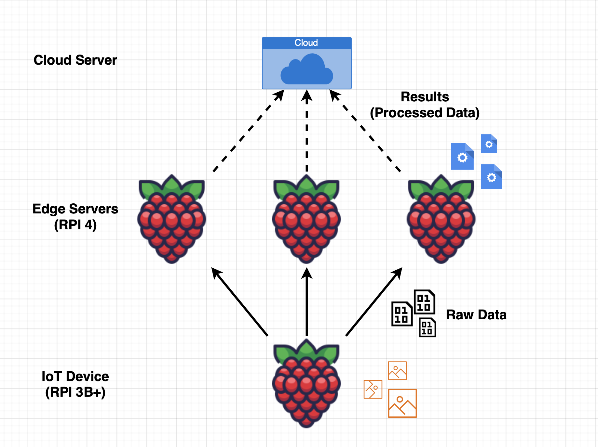

# Edge computing models for IoT Analytics

This repository contains a collection of edge computing models for IoT analytics. The models are designed to help organizations understand the benefits of edge computing and how it can be used to process data from IoT devices more efficiently. Each model provides an overview of the architecture, advantages, and use cases for edge computing in IoT analytics.

The code supports the research paper's writing process. The code is written in Python. [Raspberry Pi](https://www.raspberrypi.org/) is used as nodes in the edge computing network to simulate the edge computing environment. The code is written in Python and uses the [socketio](https://python-socketio.readthedocs.io/en/latest/) library to communicate between the nodes.

## Models

### Model 1: Edge computing with multiple edge servers

### Overview

This model is based on the idea of having multiple edge servers that are connected to the cloud. The edge servers are responsible for processing data from IoT devices and sending the results to the cloud for further analysis. This model is suitable for scenarios where low latency is required and where the cloud may not be able to handle the volume of data generated by IoT devices. The edge servers can be distributed geographically to reduce latency and improve reliability.

#### Advantages

- Low latency: Data processing is done closer to the source, reducing the time it takes to get results. This is important for real-time applications.
- Scalability: The edge servers can be easily scaled up or down based on the volume of data being generated.
- Reliability: Having multiple edge servers improves reliability as there is no single point of failure.

## Contributors

- [Minh Tran](https://minhtran-nine.vercel.app): Research Assistant, Grand Valley State University
- [Dr. Xiang Cao](https://www.linkedin.com/in/xiang-cao-15183570/): Associate Professor, Grand Valley State University
